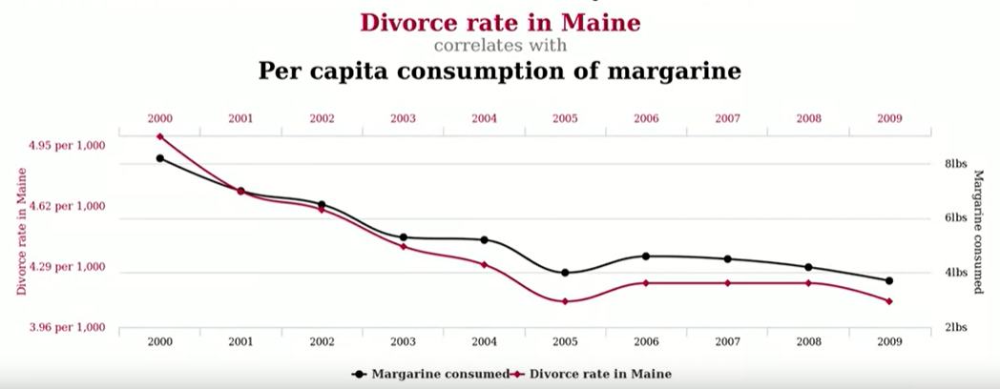
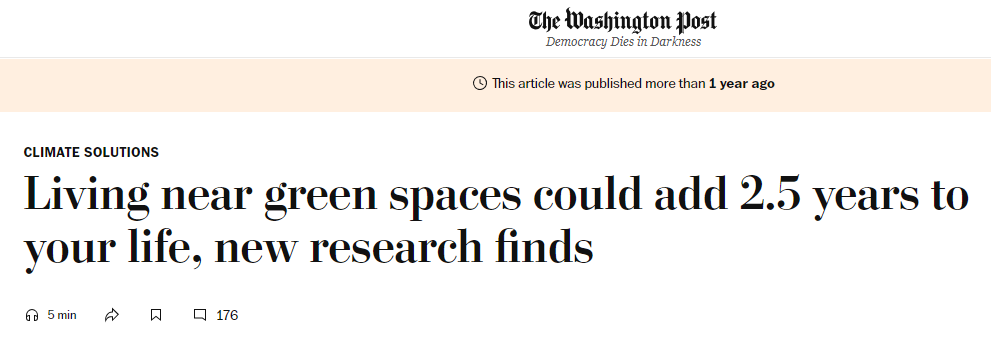
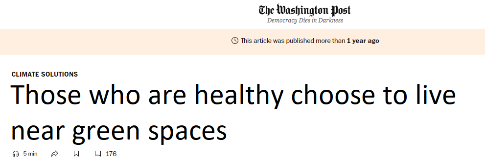

# Hello, Welcome to my Analytics Portfolio!  
Few things get to see the many sides of me like analysis projects do. There's the goofy, easy-going me, the critical and tough perfectionist, the indecisive thinker, and the determined problem-solver. Each brings out different versions of myself.  

What I love about analytics is the challenge of shifting between the big picture and the tiniest details - figuring out if a problem is worth solving, and then diving in to solve it. Whether it's the joy of automation or the grind of manual work to get sh*t done, I enjoy every single moment.

Welcome!
_________
## 1. Causal inference 

### 1.1 Causal inference when randomization (A/B testing) is feasible
Example: testing one-click autopayment enrollment feature on conversion and retention

[View my projects](Causal%20inference/AB%20testing%20is%20feasible)

### 1.2 Causal inference when randomization (A/B testing) is not feasible
Example: testing promotion effect on revenue during Xmas season

Why not randomize (for the sake of simplicity)?
- It's costly to run experiment
- It's unethical 
- Spliting user groups introduces bias

[View my projects](Causal%20inference/AB%20testing%20is%20not%20feasible)

#### Why I'm interested in causal analysis? 

People got divorce, sad, and consume margarine more (because fat taste makes them happier).  

*Or does it?* 

Another example  

*Or it can be a complete reverse direction*  

**Many ways to explain a spurious causation, you can even flip the direction of the relationship.** And that's why I'm interested in this field!

## 2. Natural Language Processing (NLP)

### 2.1. Data job market analysis 

### 2.2. Customer feedback analysis

