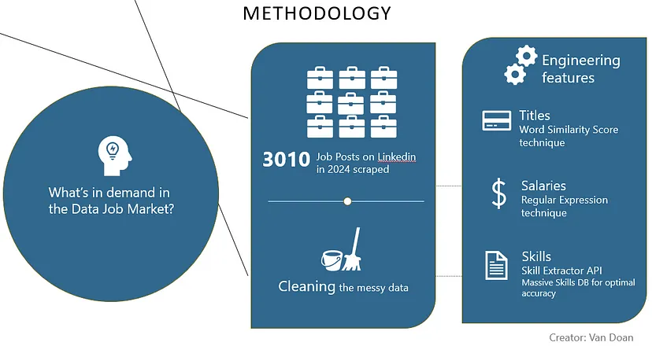

# Hello, Welcome to my Analytics Portfolio!  
Few things get to see the many sides of me like analysis projects do. There's the goofy, easy-going me, the critical and tough perfectionist, the indecisive thinker, and the determined problem-solver. Each brings out different versions of myself.  

What I love about analytics is the challenge of shifting between the big picture and the tiniest details - figuring out if a problem is worth solving, and then diving in to solve it. Whether it's the joy of automation or the grind of manual work to get sh*t done, I enjoy every single moment.

Welcome!
_________
## 1. Causal Inference

### 1.1 Causal inference when randomization (A/B testing) is feasible
Example: testing one-click autopayment enrollment feature on conversion and retention

[View my projects](Causal%20inference/AB%20testing%20is%20feasible)

### 1.2 Causal inference when randomization (A/B testing) is not feasible
Example: testing promotion effect on revenue during Xmas season

Why not randomize (for the sake of simplicity)?
- It's costly to run experiments
- It's unethical to run experiments
- Spliting user groups introduces bias

[View my projects](Causal%20inference/AB%20testing%20is%20not%20feasible)

#### For Fun: **Spurious causation is everywhere** 

If it weren't margarine sales and divorce, but app downloads and views after new page layout launch, would you assume the new release cause the drop in downloads?  

Another good example, an article from Washington Post  

*And oh, reverse direction somehow... also makes sense*  

## 2. Natural Language Processing (NLP)

### 2.1. Data job market analysis 
Scraped, cleaned / feature engineered, analyzed, and visualized insights about data job market in 2024. 

[Read my post](https://medium.com/@lunadoan/data-job-market-2024-insights-you-need-to-boost-your-career-d05c7e18a5c1)  

[View my project](Natural%20language%20processing/data-jobs.ipynb)  

### 2.2. Customer feedback analysis

Classified customer feedback text to pain point buckets and identified the most serious pain points, driving a strategic shift that increased customer satisfaction by 12%.

[Read my post](https://medium.com/@lunadoan/analyzing-customer-experience-with-multilabel-text-classification-545e80eb12d0)  

[View my project](Natural%20language%20processing/customer-feedback.ipynb)  

